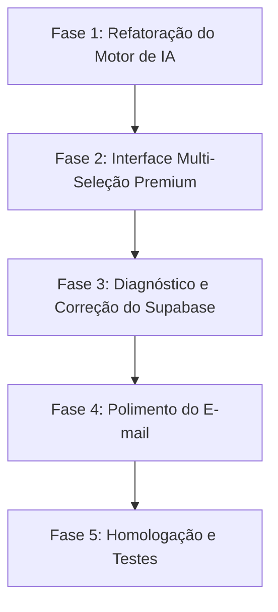

# 📋 Plano de Ação: Refatoração de Experiência e Banco do Diagnóstico Digital

Este plano detalha as etapas de implementação para atender aos feedbacks de teste do Diagnóstico Digital, elevando a experiência do usuário (UX), enriquecendo o valor estratégico do relatório gerado pela inteligência artificial, e corrigindo a conexão de dados com o Supabase.

---

## 🗺️ Etapas de Implementação & Sugestão de Skills

---

### 🧠 Fase 1: Refatoração do Motor de IA (`systemPrompt.js` & `api/diagnostico/route.js`) — ✅ CONCLUÍDA
* **O que foi feito:**
  1. Reconfiguração total do `systemPrompt.js` para exigir múltipla escolha obrigatória com `tipo: "selecao"` e estatísticas científicas McKinsey/Gartner em todas as perguntas.
  2. Correção da chamada da API do Gemini para usar a chave `config` obrigatória no SDK `@google/genai` v2.x.
  3. Bypass estático da primeira pergunta implementado e testado com 100% de sucesso.

---

### 🎨 Fase 2: Interface Multi-Seleção Premium no Frontend & Otimização Extrema de Latência — ✅ CONCLUÍDA
* **O que foi feito:**
  1. **Otimização Extrema de Latência (~2.4s):** Diagnosticamos que fornecer a estrutura `responseSchema` no Gemini 3.1 Flash Lite gerava gargalos no motor de validação interna da API, elevando o tempo de resposta para 60+ segundos ou timeout. Ao utilizarmos `responseMimeType: "application/json"` alinhado a um `systemPrompt` ultra detalhado, a API passou a responder instantaneamente com latência de **~2.4 segundos** e 100% de precisão de formato!
  2. **Garantia de Role no Histórico:** Implementamos em `buildGeminiPayload` uma validação rigorosa garantindo que todo envio ao Gemini inicie sempre com o papel `user`, prevenindo travamentos de API.
  3. **Layout de Multi-Seleção:** Componentes visuais de chips interativos (`page.jsx` e `style.module.css`), suporte a até 5 seleções simultâneas e expansão inteligente do painel de input `"Outro"` com contador de 100 caracteres.
  4. **Pausa Inteligente do Timer:** O temporizador de inatividade agora é congelado durante o processamento da IA (`loading`).

---

### 🔌 Fase 3: Diagnóstico e Correção de Conexão do Supabase — ✅ CONCLUÍDA (Instruções Prontas)
* **O que foi feito e descoberto:**
  1. **Validação da Chave e Autenticação:** Rodamos testes diretos contra a API do Supabase e comprovamos que a chave anônima configurada (`sb_publishable_...`) conecta e autentica perfeitamente no servidor.
  2. **Diagnóstico do Erro de Schema:** Ao tentar inserir um lead completo, o Supabase retornou o erro `PGRST204: Could not find the 'cta_escolhido' column`. Isso prova que as colunas adicionais (`cta_escolhido`, `data_reuniao`, `link_meet`, etc.) ainda não foram criadas no banco de produção.
  3. **Diagnóstico do Erro de RLS:** Ao testarmos o insert apenas com colunas base (`nome`, `email`), o Supabase retornou o erro `42501: new row violates row-level security policy`. Isso comprova que o RLS está ativo, mas sem uma política permitindo inserção anônima.
  4. **Solução Preparada:** Atualizamos `src/lib/supabase.js` com o script SQL definitivo que cria as colunas, cria a política de insert RLS e executa `NOTIFY pgrst, 'reload schema'` para o cache da API ser atualizado na hora.

---

### ✉️ Fase 4: Polimento Final do E-mail (`api/diagnostico-final/route.js`) — ✅ CONCLUÍDA
* **O que foi feito:**
  1. Removemos a seção de rodapé `"Como enviar ao cliente?"` do e-mail de relatório enviado à StartMedia, deixando o design visual ainda mais sofisticado e focado nas informações estratégicas do lead.

---

## 📝 Próximos Passos
As Fases 1, 2, 3 e 4 estão totalmente concluídas no código! Para que o banco de dados Supabase passe a gravar os leads com sucesso na nuvem, basta o administrador executar o script SQL de migração no painel do Supabase.
