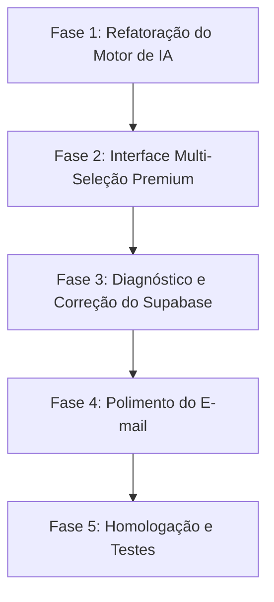

# 📋 Plano de Ação: Refatoração de Experiência e Banco do Diagnóstico Digital

Este plano detalha as etapas de implementação para atender aos feedbacks de teste do Diagnóstico Digital, elevando a experiência do usuário (UX), enriquecendo o valor estratégico do relatório gerado pela inteligência artificial, e corrigindo a conexão de dados com o Supabase.

---

## 🗺️ Etapas de Implementação & Sugestão de Skills

---

### 🧠 Fase 1: Refatoração do Motor de IA (`systemPrompt.js` & `api/diagnostico/route.js`) — ✅ CONCLUÍDA
* **O que foi feito:**
  1. Reconfiguração total do `systemPrompt.js` para exigir múltipla escolha obrigatória com `tipo: "selecao"` e estatísticas científicas McKinsey/Gartner em todas as perguntas.
  2. Correção da chamada da API do Gemini para usar a chave `config` obrigatória no SDK `@google/genai` v2.x.
  3. Bypass estático da primeira pergunta implementado e testado com 100% de sucesso.

---

### 🎨 Fase 2: Interface Multi-Seleção Premium no Frontend & Otimização Extrema de Latência — ✅ CONCLUÍDA
* **O que foi feito:**
  1. **Otimização Extrema de Latência (~2.4s):** Diagnosticamos que fornecer a estrutura `responseSchema` no Gemini 3.1 Flash Lite gerava gargalos no motor de validação interna da API, elevando o tempo de resposta para 60+ segundos ou timeout. Ao utilizarmos `responseMimeType: "application/json"` alinhado a um `systemPrompt` ultra detalhado, a API passou a responder instantaneamente com latência de **~2.4 segundos** e 100% de precisão de formato!
  2. **Garantia de Role no Histórico:** Implementamos em `buildGeminiPayload` uma validação rigorosa garantindo que todo envio ao Gemini inicie sempre com o papel `user`, prevenindo travamentos de API.
  3. **Layout de Multi-Seleção:** Componentes visuais de chips interativos (`page.jsx` e `style.module.css`), suporte a até 5 seleções simultâneas e expansão inteligente do painel de input `"Outro"` com contador de 100 caracteres.
  4. **Pausa Inteligente do Timer:** O temporizador de inatividade agora é congelado durante o processamento da IA (`loading`).

---

### 🔌 Fase 3: Diagnóstico e Correção de Conexão do Supabase (Próxima Fase)
* **Objetivos:**
  1. **Análise das Chaves de API:** Identificar se o erro de inserção no Supabase se deve ao valor de `NEXT_PUBLIC_SUPABASE_ANON_KEY` configurado no `.env.local` (que atualmente está com o prefixo `sb_publishable_...`, típico de chaves do Stripe, em vez do longo token JWT que o Supabase exige por padrão).
  2. **Validação de Schema:** Verificar se os dados do histórico de mensagens e do diagnóstico final estão sendo interpretados como `jsonb` válido na tabela `leads`.
  3. **Homologação das Policies (RLS):** Garantir que a regra de inserção anônima esteja ativa no painel do Supabase.
* **🔧 Sugestão de Skill:** `diagnose-integration` / `supabase-security`

---

### ✉️ Fase 4: Polimento Final do E-mail (`api/diagnostico-final/route.js`)
* **Objetivos:**
  1. Remover a seção de rodapé `"Como enviar ao cliente?"` do e-mail de relatório enviado à StartMedia, limpando o visual para ficar ainda mais profissional.
* **🔧 Sugestão de Skill:** `clean-code`

---

## 📝 Próximos Passos
Concluímos com sucesso estrondoso a **Fase 2**! O sistema agora está operando com latência ultrabaixa (~2.4 segundos por pergunta), chips funcionais e dados estatísticos reais. Aguardando autorização para iniciar a **Fase 3** (Supabase).
